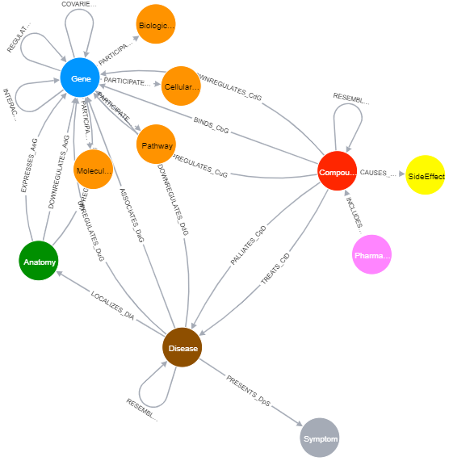

# neo4j_practice at het.io
1. Collect Symptoms for each of the disease
```
MATCH (d:Disease)--(s:Symptom) RETURN d.name,collect(s.name)
```
2. Know schema of the graph data
```
CALL db.schema()
```

</img>

3. Collect genes associated with each of the disease
```
MATCH (d:Disease)--(g:Gene) RETURN d.name,collect(g.name)
```
4. Count gene and pathways for each diseases
```
MATCH (d:Disease)--(g:Gene)--(p:Pathway) RETURN d.name,count(g.name),count(p.name)
```
5. Count and collect associated compound with disease
```
MATCH (d:Disease)--(c:Compound)--(s:SideEffect) RETURN d.name,count(DISTINCT c.name),collect(DISTINCT c.name)
```
